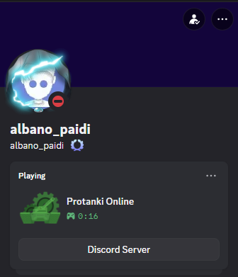
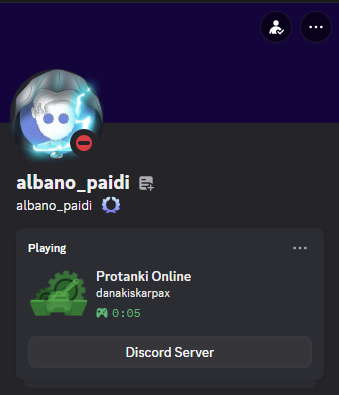

#  ProTanki Online Launcher

A lightweight launcher for **ProTanki Online** that automatically displays **Discord Rich Presence** when the game is running — no extra software, no setup beyond dropping two files in your game folder.

---

##  Preview

**Without username:**



**With username set in User.txt:**



---

##  Features

-  Launches `ProTanki.exe` automatically
-  Shows Discord Rich Presence with the Protanki Online icon
-  Displays a live timer of how long you've been playing
-  Optional **username display** — set your in-game name in `User.txt` and it appears on your Discord status
-  Always shows a **Discord Server** button that links to the community server
-  Automatically clears your Discord status when the game is closed
-  **Zero external dependencies** — built in pure Go, single `.exe` file

---

##  Installation

1. Download the latest release from the [Releases](https://github.com/giannis211/ProtankiLauncher-with-Discord-RPC-Status/releases/tag/v1)) page

```
ProTanki Online/
├── ProTanki.exe
├── ProTankiLauncher.exe   ← NEW
├── User.txt               ← NEW
├── StandaloneLoader.swf
└── ...
```


```
No flash files edit, just 2 new files
```

3. From now on, run **`ProTankiLauncher.exe`** instead of `ProTanki.exe`

---

##  Setting Your Username

Open `User.txt` with Notepad and set your in-game name:

```
User="YourNameHere"
```

Your Discord status will then show:

```
Playing Protanki Online
YourNameHere
```

To hide your name, simply leave it empty:

```
User=""
```

---

##  Building from Source

Requirements: [Go 1.21+](https://go.dev/dl/)

```bash
git clone https://github.com/YOUR_USERNAME/YOUR_REPO_NAME
cd YOUR_REPO_NAME
go build -ldflags="-H windowsgui" -o ProTankiLauncher.exe .
```

---

##  Requirements

- Windows 10 or later
- [Discord](https://discord.com/download) must be open and running before launching the game

---

##  Community

Join the Protanki Online Discord server:

[](https://discord.com/invite/protanki)
